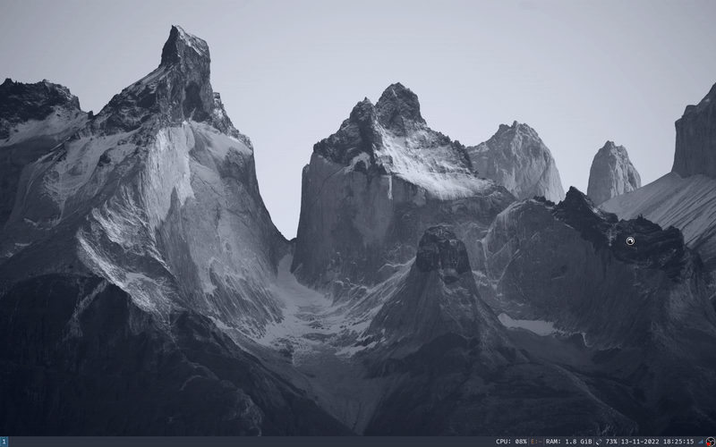

# DMBM, a bookmarking extension for dmenu in bash

*DISCLAIMER: Read this code with a grain of salt.
It is not production code, and nowhere near as optimized for efficiency as
dmenu.*

## What is it?

I like bookmarks. I use bookmarks a lot. What I don't like about bookmarks,
is that they are integrated into whatever browser I happen to be using at the
time. 

DMBM is my attempt at circumnavigating browser-dependent bookmarks, while
integrating them seamlessly into dmenu.

DMBM saves your bookmarks as plain text files, which is nice for versioning.
It also supports folder structures, so you can organize your bookmarks to
your heart's delight.



## Usage:

```
./dmbm.sh                 > Launch DMBM. Press Escape to cancel.
./dmbm.sh --append-return > Appends a 'Return' to the bookmark (will open the bookmark automatically in browsers).
./dmbm.sh -a              > Create a bookmark with the currently selected text and prompt the user on where to store it.
./dmbm.sh -d              > Prompts the user to select a bookmark and removes it from the list.
```

## Installing...
As a learning experience, the extension is packaged for Debian and Debian-based distros.
Installing via your package manager will likely be the simplest method.
With that said, the manual installation is also pretty straightforward.

### ... as a .deb package
1. Download the latest [RELEASE](link)
2. `cd` to the directory with the downloaded `dmbm.deb` file - this is usually `$HOME/Downloads`
3. Run `apt install ./dmbm.deb`

### ... as a .rpm package (TODO)

### ... manually (TODO)
